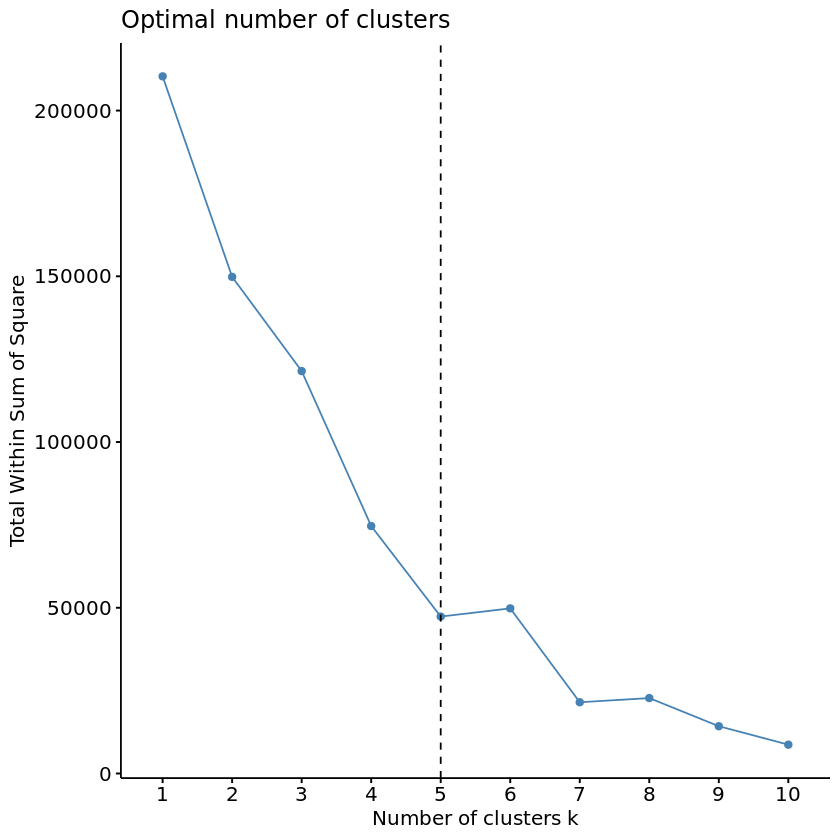
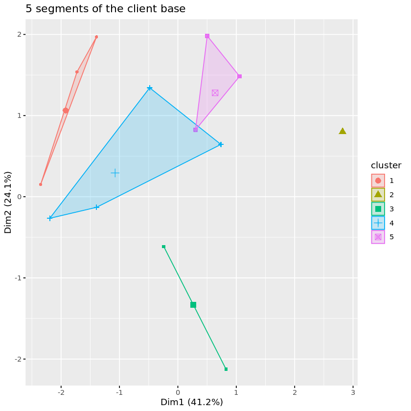
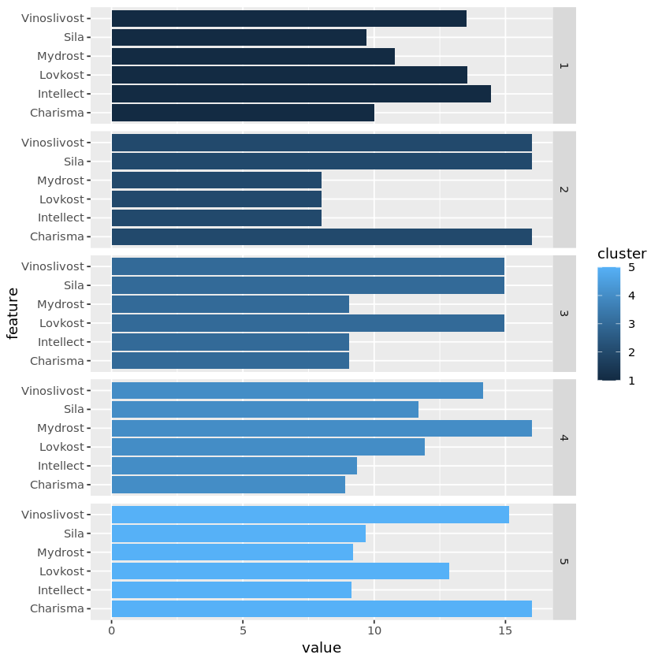
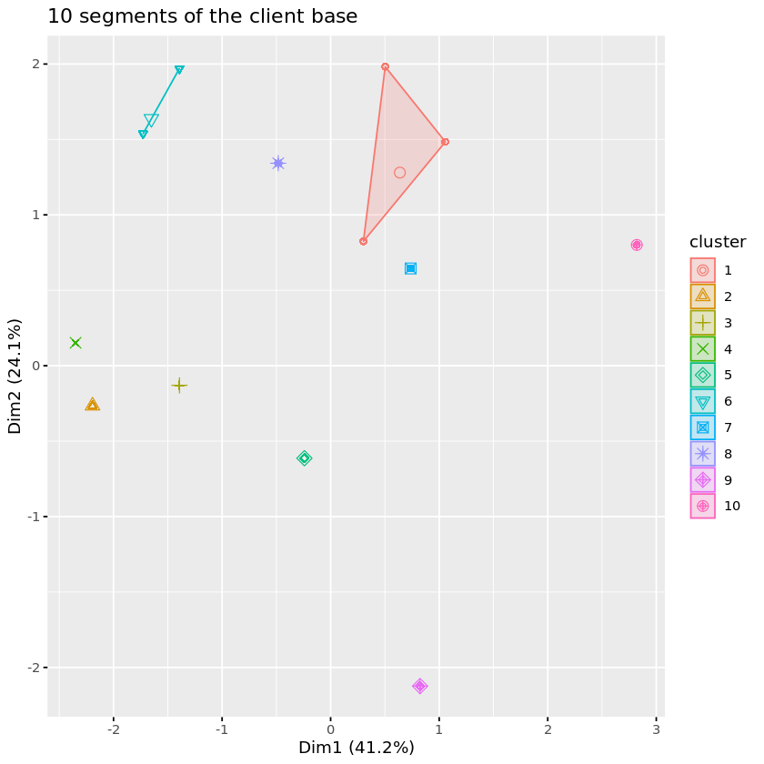
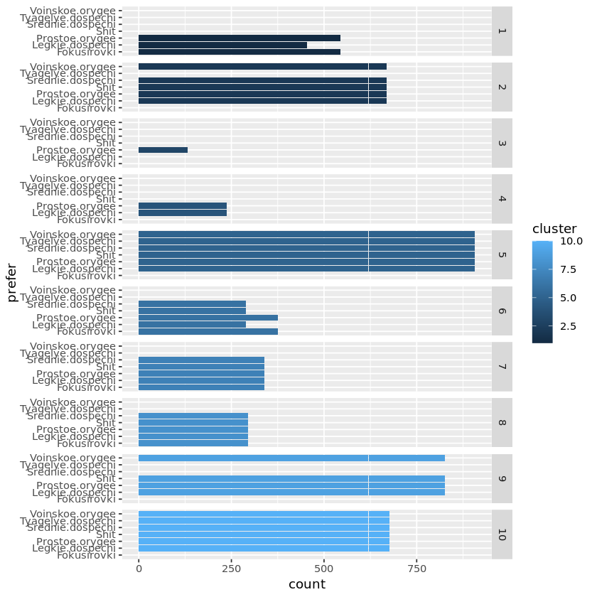
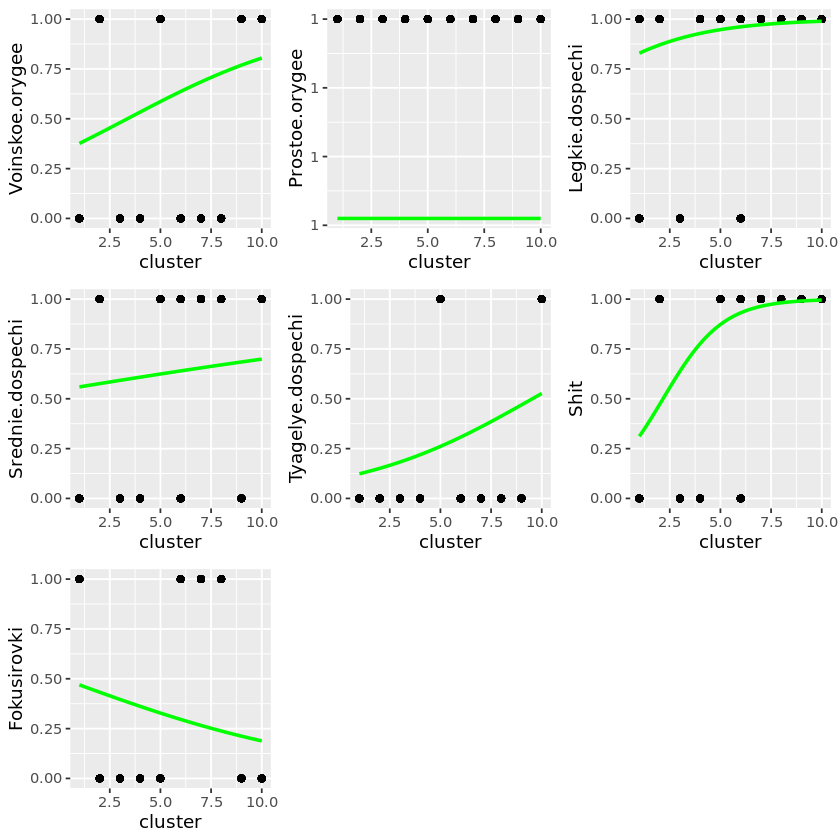
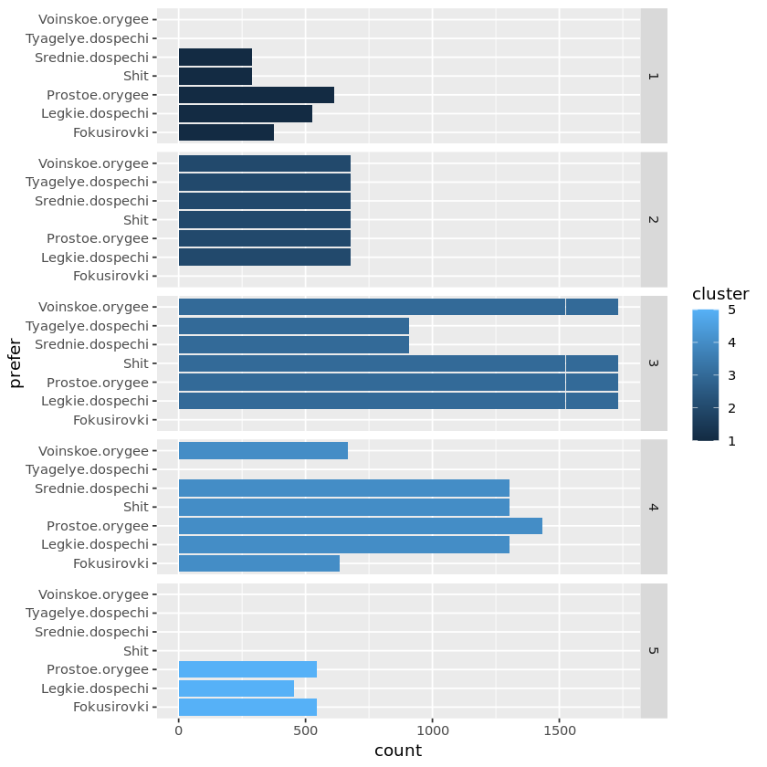
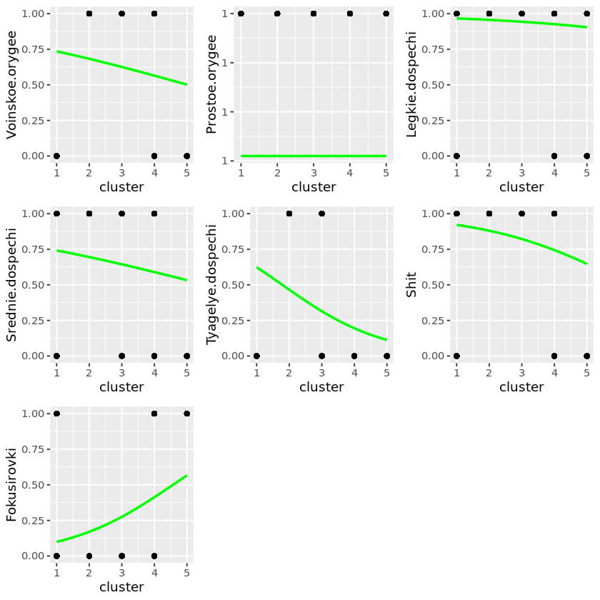

# Data settings


```R
library(tidyverse)
library(ggplot2)
library(dplyr)
library(cluster)
library(factoextra)
library(tidyr)
library(gridExtra)
magic_clients <- read.csv('magic.csv')
```


```R
## pervichny obzor faila
str(magic_clients)
summary(magic_clients)
```

    'data.frame':	5000 obs. of  15 variables:
     $ Name             : chr  "Khroald Moroznyy" "Steyn Privetlivyy" "Ragi Severnyy" "Dungal Trudnyy" ...
     $ Item             : chr  "Snaryady dlya praschi (20)" "Korotkiy luk" "Palitsa" "Kinzhal" ...
     $ Sila             : int  10 10 16 8 14 10 16 14 16 14 ...
     $ Lovkost          : int  16 12 8 16 14 14 16 14 16 8 ...
     $ Vinoslivost      : int  12 14 16 16 14 14 16 14 16 16 ...
     $ Intellect        : int  12 16 8 8 10 8 8 10 8 8 ...
     $ Mydrost          : int  12 10 8 16 10 10 8 10 8 16 ...
     $ Charisma         : int  10 10 16 8 10 16 8 10 8 10 ...
     $ Legkie.dospechi  : int  1 1 1 0 1 1 1 1 1 1 ...
     $ Srednie.dospechi : int  0 1 1 0 1 0 0 1 0 1 ...
     $ Tyagelye.dospechi: int  0 0 1 0 1 0 0 1 0 0 ...
     $ Shit             : int  0 1 1 0 1 0 1 1 1 1 ...
     $ Prostoe.orygee   : int  1 1 1 1 1 1 1 1 1 1 ...
     $ Voinskoe.orygee  : int  0 0 1 0 1 0 1 1 1 0 ...
     $ Fokusirovki      : int  0 1 0 0 0 1 0 0 0 1 ...


         Name               Item                Sila          Lovkost     
     Length:5000        Length:5000        Min.   : 8.00   Min.   : 8.00  
     Class :character   Class :character   1st Qu.:10.00   1st Qu.:10.00  
     Mode  :character   Mode  :character   Median :14.00   Median :14.00  
                                           Mean   :12.94   Mean   :12.75  
                                           3rd Qu.:16.00   3rd Qu.:14.00  
                                           Max.   :16.00   Max.   :16.00  
      Vinoslivost     Intellect         Mydrost         Charisma    
     Min.   :12.0   Min.   : 8.000   Min.   : 8.00   Min.   : 8.00  
     1st Qu.:14.0   1st Qu.: 8.000   1st Qu.: 8.00   1st Qu.: 8.00  
     Median :16.0   Median :10.000   Median :10.00   Median :10.00  
     Mean   :14.7   Mean   : 9.662   Mean   :11.13   Mean   :10.82  
     3rd Qu.:16.0   3rd Qu.:10.000   3rd Qu.:16.00   3rd Qu.:10.00  
     Max.   :16.0   Max.   :16.000   Max.   :16.00   Max.   :16.00  
     Legkie.dospechi  Srednie.dospechi Tyagelye.dospechi      Shit       
     Min.   :0.0000   Min.   :0.0000   Min.   :0.0000    Min.   :0.0000  
     1st Qu.:1.0000   1st Qu.:0.0000   1st Qu.:0.0000    1st Qu.:1.0000  
     Median :1.0000   Median :1.0000   Median :0.0000    Median :1.0000  
     Mean   :0.9386   Mean   :0.6352   Mean   :0.3168    Mean   :0.8004  
     3rd Qu.:1.0000   3rd Qu.:1.0000   3rd Qu.:1.0000    3rd Qu.:1.0000  
     Max.   :1.0000   Max.   :1.0000   Max.   :1.0000    Max.   :1.0000  
     Prostoe.orygee Voinskoe.orygee   Fokusirovki    
     Min.   :1      Min.   :0.0000   Min.   :0.0000  
     1st Qu.:1      1st Qu.:0.0000   1st Qu.:0.0000  
     Median :1      Median :1.0000   Median :0.0000  
     Mean   :1      Mean   :0.6156   Mean   :0.3108  
     3rd Qu.:1      3rd Qu.:1.0000   3rd Qu.:1.0000  
     Max.   :1      Max.   :1.0000   Max.   :1.0000  


# Clustering 


```R
client_clust <- as.data.frame(magic_clients[,3:8]) ## variables for clustering
```


```R
df <- scale(client_clust)  ## scaling for clustering
set.seed(1234)
fviz_nbclust(client_clust, kmeans, method = "wss") +
  geom_vline(xintercept = 5, linetype = 2) ## method elbow - 5 clusters
```


    

    


```R
kmeans1 <- kmeans(client_clust, centers = 5, nstart = 25)## k-means calculating
fviz_cluster(kmeans1 ,client_clust,geom = "point")+ ggtitle("5 segments of the client base") ## plot 5 clusters
centroids <- as.data.frame(kmeans1$centers) 
centroids <- cbind(centroids, c(1, 2, 3, 4, 5))
names(centroids)[names(centroids)=='c(1, 2, 3, 4, 5)'] = 'cluster'
```


    

    


# fetures of 5 clients segments


```R
ggplot(pivot_longer(centroids, cols = c(Sila, Lovkost, Vinoslivost, Intellect, Mydrost, Charisma), names_to = "feature"),
       aes(x = value, y = feature, fill = cluster)) +
  geom_bar(stat = "identity") +
  facet_grid(rows = vars(cluster))
```


    

    


```R
res.km <- eclust(df, "kmeans", nstart = 25)
res.km$nbclust ## gap stat shows 10 clusters
```


```R
kmeans2 <- kmeans(client_clust, centers = 10, nstart = 25) ## k-means for 10 clusters
fviz_cluster(kmeans2 ,client_clust,geom = "point")+ ggtitle("10 segments of the client base") ## plot 10 clusters
```


    

    


```R
centroids2 <- as.data.frame(kmeans2$centers)
centroids2 <- cbind(centroids2, c(1, 2, 3, 4, 5, 6, 7, 8, 9, 10))
names(centroids2)[names(centroids2)=='c(1, 2, 3, 4, 5, 6, 7, 8, 9, 10)'] = 'cluster'
```

# Features of 10 clusters


```R
ggplot(pivot_longer(centroids2, cols = c(Sila, Lovkost, Vinoslivost, Intellect, Mydrost, Charisma), names_to = "feature"),
       aes(x = value, y = feature, fill = cluster)) +
  geom_bar(stat = "identity") +
  facet_grid(rows = vars(cluster))
```


```R
## pie chart
## with 5 clusters
clust_numb <- c(length(which(kmeans1$cluster == "1")),length(which(kmeans1$cluster == "2")),length(which(kmeans1$cluster == "3")),length(which(kmeans1$cluster == "4")),length(which(kmeans1$cluster == "5")) )
clust_numb <- clust_numb/5000*100
clust_numb_perc <- mutate(clust_numb, Percentage = clust_numb$clust_numb/5000*100)
pie(clust_numb, labels = clust_numb)
```
```R
## with 10 clusters
clust_numb_10 <- c(length(which(kmeans2$cluster == "1")),length(which(kmeans2$cluster == "2")),length(which(kmeans2$cluster == "3")),length(which(kmeans2$cluster == "4")),length(which(kmeans2$cluster == "5")),length(which(kmeans2$cluster == "6")),length(which(kmeans2$cluster == "7")),length(which(kmeans2$cluster == "8")),length(which(kmeans2$cluster == "9")),length(which(kmeans2$cluster == "10")) )
clust_numb_10 <- clust_numb_10/5000*100
pie(clust_numb_10, labels = paste(c(1,2,3,4,5,6,7,8,9,10), 'cluster', '-',clust_numb_10, sep = ' ', '%'))
```  


## What are the preferences of the clients?


```R
favors <- as.data.frame(magic_clients[,9:ncol(magic_clients)]) ## cut the weapon part
```


```R
cluster <- as.data.frame(kmeans2$cluster) ## cluster values (for 10 clusters) 
favor_clust <- cbind(favors, cluster$'kmeans2$cluster') ## attach to each item cluster number
names(favor_clust)[names(favor_clust)=='cluster$"kmeans2$cluster"'] = 'cluster'
remove(cluster) ## reduce the mess 
```


```R
favor_clust_long <- pivot_longer(favor_clust, !cluster, names_to = "prefer", values_to = "count")
## without model, first observation
ggplot(favor_clust_long, aes(x = count, y = prefer, fill = cluster)) +
  geom_bar(stat = "identity") +
  facet_grid(rows = vars(cluster))
```


    

    


```R
## logistic regression model (method glm)
plot1 <- ggplot(favor_clust, aes(x=cluster, y=Voinskoe.orygee)) + geom_point() +
  stat_smooth(method="glm", color="green", se=FALSE,
              method.args = list(family=binomial))
plot2 <- ggplot(favor_clust, aes(x=cluster, y=Prostoe.orygee)) + geom_point() +
  stat_smooth(method="glm", color="green", se=FALSE,
              method.args = list(family=binomial))
plot3 <- ggplot(favor_clust, aes(x=cluster, y=Legkie.dospechi)) + geom_point() +
  stat_smooth(method="glm", color="green", se=FALSE,
              method.args = list(family=binomial))
plot4 <- ggplot(favor_clust, aes(x=cluster, y=Srednie.dospechi)) + geom_point() +
  stat_smooth(method="glm", color="green", se=FALSE,
              method.args = list(family=binomial))
plot5 <- ggplot(favor_clust, aes(x=cluster, y=Tyagelye.dospechi)) + geom_point() +
  stat_smooth(method="glm", color="green", se=FALSE,
              method.args = list(family=binomial))
plot6 <-  ggplot(favor_clust, aes(x=cluster, y=Shit)) + geom_point() +
  stat_smooth(method="glm", color="green", se=FALSE,
              method.args = list(family=binomial))
plot7 <-  ggplot(favor_clust, aes(x=cluster, y=Fokusirovki)) + geom_point() +
  stat_smooth(method="glm", color="green", se=FALSE,
              method.args = list(family=binomial))

grid.arrange(plot1, plot2, plot3, plot4, plot5, plot6, plot7, ncol=3) ## arrange plots in nice table
```


    

    


# 5 clusters


```R
cluster <- as.data.frame(kmeans1$cluster) 
favor_clust <- cbind(favors, cluster$'kmeans1$cluster')
names(favor_clust)[names(favor_clust)=='cluster$"kmeans1$cluster"'] = 'cluster'
remove(cluster)
```


```R
favor_clust_long <- pivot_longer(favor_clust, !cluster, names_to = "prefer", values_to = "count")
ggplot(favor_clust_long, aes(x = count, y = prefer, fill = cluster)) +
  geom_bar(stat = "identity") +
  facet_grid(rows = vars(cluster))
```


    

    

## logistic model

```R
plot1 <- ggplot(favor_clust, aes(x=cluster, y=Voinskoe.orygee)) + geom_point() +
  stat_smooth(method="glm", color="green", se=FALSE,
              method.args = list(family=binomial))
plot2 <- ggplot(favor_clust, aes(x=cluster, y=Prostoe.orygee)) + geom_point() +
  stat_smooth(method="glm", color="green", se=FALSE,
              method.args = list(family=binomial))
plot3 <- ggplot(favor_clust, aes(x=cluster, y=Legkie.dospechi)) + geom_point() +
  stat_smooth(method="glm", color="green", se=FALSE,
              method.args = list(family=binomial))
plot4 <- ggplot(favor_clust, aes(x=cluster, y=Srednie.dospechi)) + geom_point() +
  stat_smooth(method="glm", color="green", se=FALSE,
              method.args = list(family=binomial))
plot5 <- ggplot(favor_clust, aes(x=cluster, y=Tyagelye.dospechi)) + geom_point() +
  stat_smooth(method="glm", color="green", se=FALSE,
              method.args = list(family=binomial))
plot6 <-  ggplot(favor_clust, aes(x=cluster, y=Shit)) + geom_point() +
  stat_smooth(method="glm", color="green", se=FALSE,
              method.args = list(family=binomial))
plot7 <-  ggplot(favor_clust, aes(x=cluster, y=Fokusirovki)) + geom_point() +
  stat_smooth(method="glm", color="green", se=FALSE,
              method.args = list(family=binomial))

grid.arrange(plot1, plot2, plot3, plot4, plot5, plot6, plot7, ncol=3)
```

    

    

